# GDAC Tender - Lithodat Organizational Chart

**Generated:** 2025-12-18
**Source:** team-titles.csv
**Purpose:** Saudi Geological Survey (SGS) GDAC Tender submission

---

## Organizational Structure

```mermaid
graph TB
    SGS[SGS<br/>Saudi Geological Survey]

    CEO[Dr. Fabian Kohlmann<br/>Chief Executive Officer]
    ADVISOR[Dr. Mahdi AbuAli<br/>GDAC Saudi Lead]

    COO[Keith Dimech<br/>Chief Operating Officer]
    CIO[Dr. Wayne Peter Noble<br/>Chief Information Officer]
    GEO[Dr. Qusay Abeed<br/>Geological Director]

    %% COO's Team
    DATA[Vinko Novak<br/>Head of Data Security]
    CYBER[Annemarie Grass<br/>Head of Cyber Defence]
    LEGAL[Legal<br/>External Consultant]
    ACCT[Accounting<br/>External Consultant]

    %% CIO's Team
    CTO[Gerd Moritz Theile<br/>Chief Technology Officer]

    %% Backend Team under CTO
    BE1[Nirali Dudharejiya<br/>Backend Developer]
    BE2[Tarun Sengar<br/>Backend Developer]

    %% Frontend Team under CIO
    FE1[Lujia Yang<br/>Frontend Developer]
    FE2[Xinyan Zhang<br/>Frontend Developer]

    %% AI Team under CIO
    AI1[Pedro Ferreira<br/>AI Software Development Lead]
    AI2[Nilesh Vyavahare<br/>GIS Full Stack Developer]
    AI3[Dr. Behnam Sadeghi<br/>ML Technical Advisor]

    %% Geological Team
    QM[Juan Baca<br/>Quality Manager]
    GEO1[Cris Ibarra<br/>Geologist]
    GEO2[Perla Luque<br/>Geologist]
    GEO3[Dr. Alejandra Bedoya<br/>Geologist]

    %% Reporting Structure
    SGS --> CEO
    ADVISOR -.Advisory Role.-> CEO

    CEO --> COO
    CEO --> CIO
    CEO --> GEO

    %% COO's Reports
    COO --> DATA
    COO --> CYBER
    COO --> LEGAL
    COO --> ACCT

    %% CIO's Reports
    CIO --> CTO
    CIO --> FE1
    CIO --> FE2
    CIO --> AI1
    CIO --> AI2
    CIO --> AI3

    %% CTO's Reports (Backend)
    CTO --> BE1
    CTO --> BE2

    %% Geological Director's Reports
    GEO --> QM
    QM --> GEO1
    QM --> GEO2
    QM --> GEO3

    %% Styling
    classDef executive fill:#1e3a8a,stroke:#1e40af,stroke-width:3px,color:#fff
    classDef management fill:#2563eb,stroke:#3b82f6,stroke-width:2px,color:#fff
    classDef team fill:#60a5fa,stroke:#93c5fd,stroke-width:1px,color:#000
    classDef consultant fill:#fbbf24,stroke:#f59e0b,stroke-width:2px,color:#000
    classDef client fill:#10b981,stroke:#059669,stroke-width:3px,color:#fff

    class SGS client
    class CEO executive
    class ADVISOR management
    class COO,CIO,GEO management
    class CTO,QM management
    class DATA,CYBER,FE1,FE2,AI1,AI2,AI3,BE1,BE2,GEO1,GEO2,GEO3 team
    class LEGAL,ACCT consultant
```

---

## Team Summary

**Total Team Size:** 21 people

### Executive Leadership (3)
- SGS (Client - Saudi Geological Survey)
- Dr. Fabian Kohlmann - Chief Executive Officer
- Dr. Mahdi AbuAli - GDAC Saudi Lead (Advisory)

### Management (6)
- Keith Dimech - Chief Operating Officer
- Dr. Wayne Peter Noble - Chief Information Officer
- Dr. Qusay Abeed - Geological Director
- Gerd Moritz Theile - Chief Technology Officer
- Juan Baca - Quality Manager

### Technical Teams (10)
**Backend Development (2)**
- Nirali Dudharejiya - Backend Developer
- Tarun Sengar - Backend Developer

**Frontend Development (2)**
- Lujia Yang - Frontend Developer
- Xinyan Zhang - Frontend Developer

**AI/ML Team (3)**
- Pedro Ferreira - AI Software Development Lead
- Nilesh Vyavahare - GIS Full Stack Developer
- Dr. Behnam Sadeghi - ML Technical Advisor

**Geology Team (3)**
- Cris Ibarra - Geologist
- Perla Luque - Geologist
- Dr. Alejandra Bedoya - Geologist

### Security & Operations (2)
- Vinko Novak - Head of Data Security
- Annemarie Grass - Head of Cyber Defence

### External Consultants (2)
- Legal - External Consultant
- Accounting - External Consultant

---

## Key Reporting Lines

1. **SGS** → Dr. Fabian Kohlmann (CEO)
2. **Dr. Mahdi AbuAli** (dotted line advisory to CEO)
3. **CEO** → Keith (COO), Wayne (CIO), Qusay (Geological Director)
4. **Keith (COO)** → Vinko, Annemarie, Legal, Accounting
5. **Wayne (CIO)** → Moritz (CTO), Frontend Team, AI Team
6. **Moritz (CTO)** → Backend Team
7. **Qusay (Geological Director)** → Juan (QM) → Geology Team

---

## Legend

- **Solid lines** = Direct reporting relationship
- **Dotted lines** = Advisory/consulting relationship
- **Dark Blue** = Executive level
- **Blue** = Management level
- **Light Blue** = Team members
- **Yellow** = External consultants
- **Green** = Client (SGS)

---

**Note:** This organizational structure is designed specifically for the GDAC tender submission to demonstrate team capabilities and reporting hierarchy.
