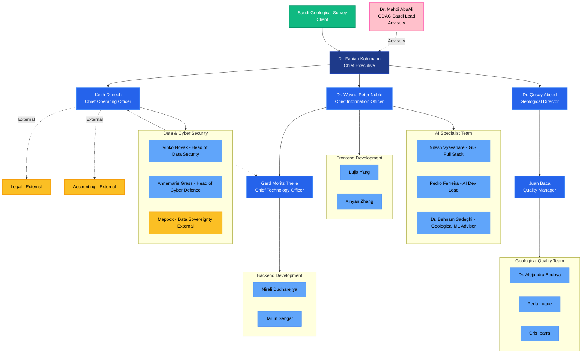

# LITHODAT-QUALITY-ASSURANCE.md

## 1. Quality Management Systems and Standards

Lithodat follows internationally recognised frameworks for software quality, data governance and scientific data management. While Lithodat is not currently ISO-certified at the organisational level, its internal processes and platform architecture fully align with:

### • ISO 9001 – Quality Management Systems
- Documented, process-driven development workflows  
- Strong customer focus and delivery reliability  
- Clear product lifecycle management  
- Continuous improvement procedures  

**Status:** Alignment

---

### Information Security Management
Lithodat’s platform and operational practices adhere to ISO 27001 principles through:

- Role-based access control  
- Network segmentation  
- Encryption of all data at rest and in transit  
- Secure SDLC  
- Continuous monitoring and log auditing  

**Status:** Alignment (not formally certified)

**Note:** Infrastructure runs entirely on AWS, which *is* ISO 27001-certified.

---

### • FAIR Data Principles
Lithodat applies the FAIR standards (Findable, Accessible, Interoperable, Reusable) across all its national scientific data platforms (EarthBank, NRCan thermochronology, isotope platforms).

---

## 2. Quality Control Processes for Software Development

Lithodat maintains a robust SDLC with:

### • Code Quality Controls
- Mandatory peer review for all code submissions  
- Linting and style enforcement  
- Git workflows with protected branches and pull request gating  

### • Development Workflow
- Agile methodology with sprint cycles  
- Staging and pre-production environments  
- Versioned releases with change logs  

### • Documentation
- API documentation  
- Data model schemas and metadata specifications  
- Infrastructure-as-code documentation  

---

## 3. Testing and Validation Procedures

### • Unit Testing
Automated tests validate data handling, transformations and business logic.

### • Integration Testing
Ensures compatibility across ingestion pipelines, services and cloud infrastructure.

### • End-to-End Testing
Simulates user workflows at scale.

### • Performance & Load Testing
Validates scalability for national datasets and concurrent user access.

### • Security Testing
- Vulnerability scanning  
- Access control verification  
- Optional penetration testing (as requested by government clients)

### • User Acceptance Testing (UAT)
Conducted with GA, CSIRO, ARDC, NRCan and State Surveys prior to deployment.

---

## 4. Data Quality Assurance Methodologies

Lithodat is a leader in scientific data quality frameworks, including:

### • Schema Validation
Strict enforcement of controlled vocabularies, units, data types and metadata completeness.

### • Automated QA/QC Pipelines
- Outlier detection  
- Logical consistency checks  
- Duplicate identification  
- Age-model validation for thermochronology  
- Cross-field validation (e.g., chemistry + sample metadata)

### • Provenance and Version Control
Full traceability of every data change, versioned record histories and audit logs.

### • Interoperability Across Agencies
Ensures compatibility between Geoscience Australia (GA), State Surveys, CSIRO, ANSTO, NMI, NRCan and international standards.

---

## 5. Continuous Improvement Processes

### • Agile Review Mechanism
Regular sprint reviews, retrospectives and iterative improvement cycles.

### • Stakeholder Feedback
Workshops and alignment sessions with national partners including GA, State Surveys, NRCan, CSIRO and universities.

### • Monitoring & Alerting
- AWS CloudWatch metrics  
- Automated failure alerts  
- Continuous performance tuning

### • Post-Deployment Review
Formal lessons-learned analysis and process optimisation.

---

## 6. Quality Certificates Held

### • CoreTrustSeal (CTS) – Certified Trusted Scientific Repository
Lithodat is officially **CoreTrustSeal certified** through the EarthBank (AusGeochem) repository, validating:

- Trusted long-term data stewardship  
- FAIR data adherence  
- Sustainable governance  
- Robust data integrity and QA/QC systems  
- Compliance with international repository standards  

**Certification status:**  
- Certified: **Yes**  
- Certified Repository: **EarthBank / AusGeochem**  
- Certification Body: **CoreTrustSeal**  
- Affiliation: **World Data System (WDS)**  
- Certificate Number: *To be inserted*  
- Validity Dates: since 2023

---

### • World Data System (WDS)
EarthBank/AusGeochem is recognised under the **World Data System**, part of the International Science Council.  
This demonstrates compliance with global standards for trusted scientific data infrastructures.

---

### • AWS Cloud Security and Compliance (Inherited Controls)
Lithodat operates exclusively on **Amazon Web Services**, inheriting all AWS security certifications and controls, including:

- ISO 27001 (Information Security)  
- ISO 27017 (Cloud Security)  
- ISO 27018 (Cloud Privacy)  
- SOC 1 / SOC 2 / SOC 3 compliance  
- PCI-DSS compliance (where applicable)  
- CSA STAR Level 2  

AWS provides:
- world-class physical and cyber security  
- encryption by default (at rest and in transit)  
- 24/7 monitored data centres  
- continuously audited infrastructure  

Lithodat’s platform therefore benefits from **enterprise-grade, internationally certified security** as part of its operational environment.

---

---

## 7. Organizational Structure

Lithodat's organizational structure supports effective quality management through clear reporting lines and specialized teams:

**Key Quality-Related Roles:**

- **Quality Manager (Juan Baca):** Reports to Geological Director, oversees geological quality team and QA/QC processes
- **Data & Cyber Security Team:** Ensures information security, data sovereignty, and cyber defence
- **Geological Quality Team:** Three geologists ensuring scientific data accuracy and validation
- **AI Specialist Team:** Includes geological ML technical advisor for algorithm quality assurance
- **External Support:** Legal and accounting consultants for compliance oversight

---

# Summary
Lithodat maintains strong quality assurance, security and scientific data management processes, supported by:

- ISO-aligned internal processes
- CoreTrustSeal certification
- World Data System recognition
- AWS-certified infrastructure security
- Robust QA/QC, testing, validation and development workflows
- Clear organizational structure with dedicated quality management roles

These combined systems ensure Lithodat can deliver a **secure, reliable, high-quality** geoscience AI platform to meet GDAC-SA requirements.
