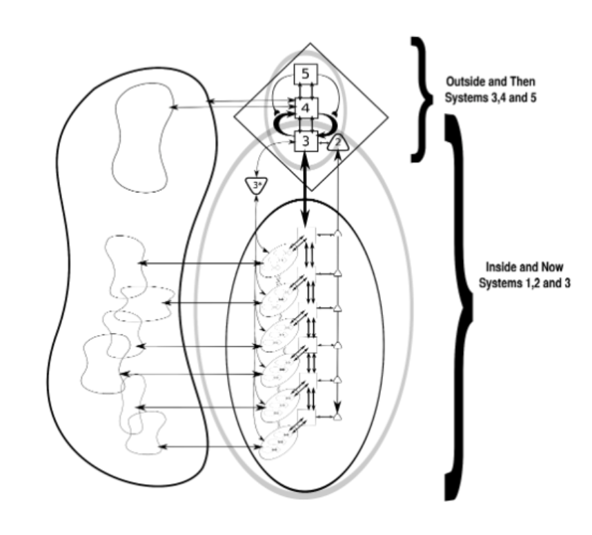

# Viable Systems Model (VSM) Framework Guide

**Purpose:** Provide a comprehensive understanding of VSM principles to inform platform design and usage.

**Source:** Stafford Beer's cybernetic management theory, as presented in "Diagnosing the System for Organisations"

---

## 🎯 Core Principle

> **"The purpose of a system is what it does"**
>
> — Stafford Beer

Not what it claims to do, not what you hope it does, but what its actual outputs demonstrate. This principle grounds VSM in observable reality.

---

## 📚 Six Fundamental Concepts

### 1. Viability

**Definition:** The ability to maintain separate existence both now AND into the future.

**For Organizations:**
- Can it survive today's operations? (Immediate viability)
- Can it adapt for tomorrow's challenges? (Future viability)
- Does it have both operational capability AND strategic foresight?

**Platform Implication:** Must diagnose both current sustainability and future readiness.

---

### 2. Recursion

**Definition:** Systems within systems - fractal structure where each level contains the same five functions.


**Figure 2: Recursive Structure Across Three Levels**
- **Recursion 0:** Whole organization (top level)
- **Recursion 1:** Major operational units (e.g., divisions, business units)
- **Recursion 2:** Teams within each unit (e.g., departments, project teams)
- **Key Principle:** Each viable system contains viable systems and is itself contained in a viable system
- **Note:** Each box contains its own complete VSM structure (Systems 1-5)

**Visual Structure:**
```
Mining Industry
├── BHP
│   ├── Olympic Dam Mine
│   │   ├── Resource Mapping (has M, O, E)
│   │   ├── Extraction (has M, O, E)
│   │   └── Metallurgy (has M, O, E)
│   └── Other Mines...
└── Other Companies...

Where:
M = Management
O = Operations
E = Environment
```

**Lithodat Example:**
```
Recursion 0: Lithodat (Company)
├── LithoSurfer (System 1 at R0, complete VSM at R1)
│   ├── Recursion 1: Has own Systems 1-5
│   ├── Frontend team (System 1 at R1, complete VSM at R2)
│   ├── Backend team (System 1 at R1, complete VSM at R2)
│   └── Product management (System 1 at R1, complete VSM at R2)
├── LithoBuild (System 1 at R0, complete VSM at R1)
│   ├── Recursion 1: Has own Systems 1-5
│   ├── Project teams (System 1 at R1, complete VSM at R2)
│   └── Client relationships (System 1 at R1, complete VSM at R2)
└── LithoData (System 1 at R0, complete VSM at R1)
    ├── Recursion 1: Has own Systems 1-5
    ├── LithoClean sub-system (System 1 at R1, complete VSM at R2)
    ├── LithoMine sub-system (System 1 at R1, complete VSM at R2)
    └── Data curation team (System 1 at R1, complete VSM at R2)
```

**Platform Implication:** Must support recursive application - apply VSM at company level, then within each operational unit.

---

### 3. Variety

**Definition:** Measure of system complexity - the number of possible states or variables.

**Visual Analogy - Juggling:**
- 1-2 balls: Easy to manage
- 3-4 balls: Increasingly complex
- 5+ balls: Options:
  - Hire help (add resources)
  - Get better at juggling (improve skills)
  - Invent a machine (automate)

**Chess Example:**
- Two unknown players = Too much variety to predict outcome
- World champion vs. beginner = Reduced variety, predictable outcome

**Lithodat Example:**
- 3 directors doing everything = Manageable variety
- 14 employees across 3 systems = Higher variety
- 25 employees + customers + market = Much higher variety

**Platform Implication:** Must help reduce variety through clarity, structure, and automation.

---

### 4. Law of Requisite Variety

**Statement:** "A control system must have as many possible states as the system it wants to control."

**Police Example:**
- Population has high variety (millions of possible actions)
- Police given variety amplifiers:
  - Guns (physical control)
  - Arrest authority (legal control)
  - Investigation powers (information gathering)
  - Communication systems (coordination)

**Management Example:**
- Operations have high variety (many activities, decisions, problems)
- Management needs variety to match:
  - Information systems (see what's happening)
  - Decision frameworks (respond appropriately)
  - Resources (implement decisions)
  - Policies (guide behavior)

**Platform Implication:** Must give leadership requisite variety to manage growing organization - dashboards, decision tools, communication systems.

---

### 5. Attenuators & Amplifiers

**Purpose:** Balance variety between management and operations.

**Attenuators** (Information UP - reduce complexity):
- Dampen high-variety information going to management
- Filter, summarize, aggregate operational details
- Examples:
  - Monthly project reports (not daily updates)
  - Financial dashboards (not every transaction)
  - KPI summaries (not raw data)
  - Exception reports (only problems)

**Amplifiers** (Control DOWN - strengthen signals):
- Strengthen control signals going to operations
- Ensure instructions are understood and followed
- Examples:
  - Training programs
  - Policies and procedures
  - Code review gates
  - Invoice deadlines
  - Automated workflows

**Rule 1:**
> "Managerial, operational and environmental varieties will balance in the end - but they should be designed to do so with minimal damage to the people and to cost."

**Platform Implication:** Must provide both:
- Attenuation tools (reporting, dashboards, summaries)
- Amplification tools (communication, policies, automation)

---

### 6. Black Box Thinking

**Concept:** Organization is too complex to map every internal process. Focus on inputs and outputs.

**Visual:**
```
Input (Stimulus) → [BLACK BOX] → Output (Response)
   │                              │
   ├─ Data                       ├─ Products
   ├─ Staff                      ├─ Services
   ├─ Code                       ├─ Revenue
   ├─ Design                     └─ Growth
   └─ Management
```

**Key Insight:** By controlling inputs and measuring outputs, you can direct the system without micromanaging internal processes.

**Lithodat Questions:**
- **Inputs:** What goes in? (Data, staff, code, design, invoicing, management)
- **Outputs:** What comes out? (Turnover $1.3M, 14 staff, products/services)
- **Control:** How do we adjust inputs to get desired outputs?

**Platform Implication:** Don't try to control every detail - focus on strategic inputs and measure key outputs.

---

## 🏗️ The Five Systems Framework

### Overview Table

| System | Function | Core Question | Focus |
|--------|----------|---------------|-------|
| **System 1** | Operations | Are we doing the work effectively? | PRESENT: Delivery |
| **System 2** | Coordination | How do we keep things running smoothly? | PRESENT: Harmony |
| **System 3** | Control | Are we using our capabilities efficiently? | PRESENT: Optimization |
| **System 4** | Intelligence | Are we ready for what's coming next? | FUTURE: Adaptation |
| **System 5** | Policy | Who are we, and why do we exist? | ETERNAL: Identity |

**Critical Insight:** All five systems must function together. Missing or weak systems cause organizational dysfunction.

### Visual Representation


**Figure 1: Basic VSM Structure**
- **E (Environment):** The external niche where the organization operates (customers, competitors, market)
- **O (Operations):** System 1 units (1a, 1b, 1c) - the operational teams doing the core work
- **M (Meta-system):** Systems 2, 3, 3*, 4, 5 - management and coordination functions
- **Key Insight:** Operations interact directly with environment, while meta-system provides coordination and strategic direction

---

## 📊 SYSTEM 1: Operations (THE DOING)

### Purpose
Delivers the organization's core activities and services - the actual work that creates value.

### Key Characteristics

Each System 1 unit MUST be:
1. **Viable on its own** - Could operate independently if separated
2. **Has own customers/stakeholders** - Someone receives its outputs
3. **Produces measurable outputs** - Clear deliverables
4. **Has autonomy for day-to-day delivery** - Makes operational decisions
5. **Has own management** - Someone responsible for its success
6. **Can be removed as separate entity** - Could be sold, spun off, or eliminated
7. **Has own culture and rhythm** - Own scheduling, norms, processes

### Mine Example (from presentation)
```
Mining Operation System 1 Units:
├── Resource Mapping
│   └── Can function independently, has geologists, produces maps
├── Extraction
│   └── Can function independently, has miners, produces ore
├── Metallurgy
│   └── Can function independently, has processors, produces metal
└── Transport
    └── Can function independently, has drivers, delivers product
```

### Diagnostic Questions

**For Lithodat:**
- What are our operational units?
- Can each operate independently?
- Do they have clear outputs and customers?
- Can they be sold separately?
- Do employees know which unit they belong to?
- Are tasks clearly categorized by unit?

**Warning Signs:**
- Units can't function without constant coordination
- Unclear which unit owns which work
- Staff work across all units without "home"
- No clear unit-specific metrics or goals

### Platform Requirements
- Map operational units visually
- Define boundaries and interfaces
- Track resources per unit
- Measure unit-specific outputs
- Support recursive VSM within each unit

---

## 🔄 SYSTEM 2: Coordination (THE HARMONY)

### Purpose
Keeps work stable and synchronized; prevents conflict between System 1 operational units.

### Key Function
- Prevents friction and oscillation between units
- Ensures units function without interfering with each other
- Manages shared resources and scheduling
- Maintains operational rhythm

### Mine Example
**Without System 2:**
- Geologist mapping while blasting happens → injury/death
- Two teams need same equipment → conflict

**With System 2:**
- Scheduling/timetable prevents conflicts
- Communication protocols keep everyone informed
- Shared resource booking systems
- Regular coordination meetings

### Rule 2
> "The communication channels between parts of the system (management ↔ operations ↔ environment) must be fast and wide enough to handle the information those parts produce."

**Implication:** If channels are too slow or narrow, information backs up and decisions suffer.

### Diagnostic Questions

**For Lithodat:**
- Where does coordination break down?
- Do people repeat or duplicate efforts?
- Are there conflicts over shared resources?
- Do communication channels handle the volume?
- Can we automate coordination without adding bureaucracy?

**Warning Signs:**
- Same question asked multiple times to different people
- Work gets re-done because someone didn't know
- Meeting proliferation to coordinate
- "Did you know X was doing Y?" surprises

### Platform Requirements
- Visual coordination mechanisms
- Communication protocol templates
- Meeting structure guidelines
- Shared calendar and resource booking
- Dependency tracking between units
- Automation opportunities identification

---

## ⚙️ SYSTEM 3: Control & Optimization (THE EFFICIENCY)

### Purpose
Ensures operations are collectively efficient, compliant, and aligned with organizational goals.

### Key Function
- Sits above day-to-day operations
- Provides internal governance and resource control
- Converts "noise of multiple operations into coherent, optimized performance"
- Allocates resources across units
- Monitors compliance and quality

### Components

**System 3 (Management & Control):**
- Resource allocation decisions
- Budget management
- Performance monitoring
- Policy enforcement
- Day-to-day priority setting

**System 3* (Audit):**
- Sporadic audits "on the ground"
- Verify what's really happening
- Check compliance
- Quality assurance
- "Trust but verify"

### Mine Example
- **System 3:** Management, accounting, finance, procurement, HR, safety teams
- **System 3*:** Safety inspections, financial audits, quality checks

### Diagnostic Questions

**For Lithodat:**
- Where do we see truth of our performance?
- How do we know if we're making money?
- Who makes day-to-day priority/resourcing decisions?
- How quickly do problems surface?
- How do we verify quality across projects?
- Where do people feel overloaded or blind?
- Do people know what they're responsible for?

**Warning Signs:**
- Financial surprises (didn't know we were losing money)
- Quality issues discovered late
- No one knows who decides priorities
- Resources allocated reactively
- No systematic audit or review

### Platform Requirements
- Resource allocation tools
- Budget tracking and forecasting
- KPI dashboards
- Audit schedules and checklists
- Quality metrics tracking
- Decision logging and ownership
- Financial integration (Xero)

---

## 🔭 SYSTEM 4: Intelligence & Future (THE FORESIGHT)

### Purpose
Scans external environment, drives innovation, plans for the future.

### Key Function
- Looks outward into the 'Environment'
- Scans for threats and opportunities
- Explores innovations for future viability
- Balances with System 3's focus on today

### Mine Example
- Onsite exploration extending resource base
- Technical services trialing new methods
- Sustainability planners forecasting carbon legislation
- Market analysts watching commodity prices

**Warning Without Strong System 4:**
> "Organization becomes efficient but short-sighted - focused on today's production while unprepared for tomorrow's climate, regulations, or technology shifts."

### Diagnostic Questions

**For Lithodat:**
- Where does intelligence about outside environment come from?
- How do we decide which signals are worth acting on?
- How do outside ideas make their way into projects/priorities?
- What future changes could disrupt us if we don't prepare now?
- How do we find out what potential customers want?
- How do we tell the world about our products?
- Do we know who competitors are and what they do?
- What does industry think about us?

**Warning Signs:**
- Surprised by competitor moves
- Market shifts catch us off guard
- "Why didn't we see this coming?"
- Innovation happens accidentally, not systematically
- No clear owner of market intelligence

### Platform Requirements
- Environmental scanning tools
- Competitive intelligence database
- Customer feedback collection
- Trend monitoring and alerts
- Innovation pipeline tracking
- Future scenario planning
- Integration with System 3 for resource allocation

---

## 🎯 SYSTEM 5: Policy & Identity (THE PURPOSE)

### Purpose
Defines identity, purpose, and direction; provides overall policy, values, and decision-making principles.

### Key Function
- Provides coherence to everything happening within organization
- Balances short-term control (System 3) with long-term vision (System 4)
- Resolves conflicts between systems
- Defines "who we are"

### Mine Example
- Site's shared purpose and culture
- Strategic priorities that shape decision-making
- Values that guide behavior
- Can have own aims even if parent company different

**Warning Without Clear System 5:**
> "Organization can operate efficiently and plan intelligently, yet lack unity of purpose - drifting between conflicting goals rather than acting as single, coherent system."

### Diagnostic Questions

**For Lithodat:**
- What is our perfect platform?
- What is our ideal customer base?
- What culture do we want?
- How many employees, what structure?
- What assets will we own?
- What turnover and size?
- How are we progressing toward this goal?
- What can get in the way?
- What are our risks?
- Do employees, customers, and industry know this vision?

**Warning Signs:**
- Different leaders have different visions
- Team doesn't know where company is going
- Conflicting priorities can't be resolved
- Strategic drift - no clear direction
- Values stated but not lived

### Platform Requirements
- Vision articulation tools
- Values definition and assessment
- Strategic goal setting frameworks
- Scenario planning capabilities
- Leadership alignment tools
- Vision communication templates
- Progress tracking toward utopia

---

---

## 📊 Inside and Now vs. Outside and Then

The VSM creates a clear separation between operational concerns (present) and strategic adaptation (future):



**Figure 3: The Two Fundamental Organizational Concerns**

**Inside and Now (Systems 1, 2, 3):**
- Managing today's operations
- Coordinating current activities
- Optimizing resource use
- Ensuring operational effectiveness
- Dealing with internal complexity

**Outside and Then (Systems 3, 4, 5):**
- Scanning the external environment
- Planning for future challenges
- Developing strategic responses
- Balancing today's needs with tomorrow's opportunities
- System 3 is the bridge between both worlds

**Key Insight:** System 3 participates in both domains - it must balance operational efficiency (inside/now) with strategic adaptation (outside/then). This is why System 3 is shown in both areas of the diagram.

---

## 🔗 Communication & Transduction

### Rule 3: Transduction

**Concept:** Messages undergo 'transduction' - they are interpreted by the receiving party.

**Example:** "Defund the Police"
- Three simple words
- Can be interpreted many different ways:
  - Eliminate all police funding?
  - Reduce budgets and reallocate?
  - Reform how police are funded?
  - Symbolic statement about priorities?

**Key Point:** Sender's message, information, and intention must meet the 'variety' of the channel.

### Implications for Communication

**Attenuators (UP):**
- Are we providing enough context in reports?
- Do summaries lose critical information?
- Can leaders understand operational reality from reports?

**Amplifiers (DOWN):**
- Are messages clear and unambiguous?
- Do directives include sufficient context?
- How do we know instructions were understood?

### Platform Requirements
- Context-rich communication tools
- Feedback loops to verify understanding
- Templates that prompt for necessary detail
- AI assistance in summarizing without losing meaning
- Multiple communication modalities (text, visual, data)

---

## 🌍 Environmental Context

### Key Insight
Organizations exist in multiple environments simultaneously.

**Lithodat Example:**
```
Environment 1: Geoscience Data Companies
├── Competitors: ESRI, Leapfrog, GIM Suite, Prospector
└── Market: Geological software and tools

Environment 2: AI Technology Providers
├── Competitors: Geominer.AI, DataRock, MaxGeo, OpenMine.AI
└── Market: AI/ML applications for geology

Environment 3: EarthBank Vision
├── Partners: AGN, Academics, Australian Government, Geoscience Australia
└── Market: Data repository and knowledge platform
```

**Platform Implication:** Must support analysis of multiple competitive environments and positioning strategies.

---

## 🎯 VSM Diagnostic Process: Self-Transformation Methodology (STM)

**Source:** Proven methodology from Max Clean case study (1,200 employees, 6-month intervention)


**Figure 4: The 7-Stage Self-Transformation Methodology (STM)**

This iterative cycle shows the proven process used by Max Clean and other successful VSM interventions:
1. **Specify the System-in-focus** (Identity and purpose)
2. **Identify recursive levels** (Organizational structure)
3. **Clarify strategic direction & goals** (Economic, social, environmental)
4. **Design/adjust progress measurement KPIs** (5-7 key indicators)
5. **VSM Diagnosis** (Structural analysis and capabilities assessment)
6. **Align strategy/structure & capabilities** (Action planning)
7. **Assess progress & learn** (Iterative improvement - the dashed oval indicates continuous cycling)

**Key Success Factors:**
- 6 iterations over 6 months
- 15-day feedback loops (not monthly!)
- Participatory workshops with all organizational levels
- Visual progress tracking (green/red dots)
- Results: Client satisfaction 69%→85%, significant structural improvements

---

### Stage 1: Specify the System-in-Focus

**Purpose:** Achieve agreement on perceived organizational identity and purpose

**Activities:**
- Workshop with Diagnostic Committee (DC) and leadership
- Agree on identity statement (example from Max Clean):
  > "Max Clean is a company that provides services... using cutting edge technology... respecting the environment and creating value for the community"
- Document current purpose and aspirations
- Create shared language for transformation

**Lithodat Questions:**
- What is Lithodat's identity today?
- What do we do that makes us unique?
- How do we create value for customers, employees, community?
- What are our boundaries (what we do/don't do)?

**Output:** Agreed identity statement that all stakeholders support

---

### Stage 2: Identify Recursive Levels

**Purpose:** Map the nested viable systems responsible for primary activities

**Activities:**
- Workshop to identify operational levels
- Map recursive structure (national → regional → service in Max Clean)
- Identify System 1 units at each level
- Document which level manages which complexity

**Lithodat Context:**
```
Level 0: Lithodat (whole company)
Level 1: LithoSurfer / LithoBuild / LithoData (operational systems)
Level 2: Within each system (e.g., LithoClean, LithoMine sub-systems)
```

**Warning Signs from Max Clean:**
- Managers operating at multiple recursion levels (bottlenecks)
- Micro-management reducing operational autonomy
- Need for clear leaders at each level with legitimacy and power

**Output:** Recursive map showing all viable systems at each level

---

### Stage 3: Clarify Strategic Direction & Goals

**Purpose:** Review strategic direction and goals across all dimensions (economic, social, environmental)

**Activities:**
- With DC members, review main strategic direction
- Identify economic goals (revenue, growth, profitability)
- Identify social goals (employee well-being, community impact)
- Identify environmental goals (sustainability, resource use)
- Study connections between goals (e.g., employee training → quality → client satisfaction)

**Lithodat Context:**
- Utopia visions from each director
- 3-month, 6-month, 12-month, 5-year goals
- System-specific goals (Surfer/Build/Data)
- Cross-functional goals (Dev, Marketing, HR, Finance)

**Output:** Strategic direction document with interconnected goals

---

### Stage 4: Design/Adjust Progress Measurement System (KPIs)

**Purpose:** Design progress measurement based on essential variables

**Activities:**
- Identify 5-7 Key Performance Indicators (KPIs)
- Ensure KPIs cover operational, social, environmental dimensions
- Design data collection processes
- Set baseline measurements
- Agree on review frequency (recommend 15-day cycles)

**Max Clean KPI Results (6 months):**
- Client satisfaction: 69% → 85%
- Recruitment: 66 → 89
- Payroll compliance: 64 → 78
- Chemical use: 1850L → 1300L/month
- Training: 220 employees + families

**Lithodat KPIs (suggested):**
- Revenue growth and cash flow
- Client/customer satisfaction
- Employee clarity on vision (survey)
- OKR completion rates (70% target)
- Time from strategy decision to execution
- System-specific metrics (Surfer subscribers, Build project margins, Data volume)
- Team capacity utilization

**Output:** KPI dashboard with 15-day review schedule

---

### Stage 5: VSM Diagnosis (Structural & Capabilities Analysis)

**Purpose:** Identify structural problems, capability limitations, and learning capacity at each recursion level

**Activities:**
- Semi-structured interviews with employees from different levels/roles
- Workshops using VSM meta-questions for Systems 1-5
- Identify structural problems within System 1
- Assess capacity to deal with core issues
- Evaluate existing adapting and learning capabilities
- Use visual tools: flowcharts, mind maps, recursive mapping

**VSM Meta-Questions by System:**

**System 1 (Operations):**
- What are the operational units?
- Are they truly viable independently?
- Can each operate without constant coordination?
- Do they have clear outputs and customers?
- Can they be sold separately?
- Do employees know which unit they belong to?

**System 2 (Coordination):**
- Where does coordination break down?
- Do people repeat or duplicate efforts?
- Are there conflicts over shared resources?
- Do communication channels handle the volume?
- Can we automate coordination?

**System 3 (Control/Optimization):**
- Where do we see truth of our performance?
- Who makes day-to-day priority/resourcing decisions?
- How quickly do problems surface?
- How do we verify quality across projects?
- Do people know what they're responsible for?

**System 4 (Intelligence/Future):**
- Where does intelligence about outside environment come from?
- How do we decide which signals are worth acting on?
- How do outside ideas make their way into projects/priorities?
- What future changes could disrupt us?

**System 5 (Policy/Identity):**
- What is our perfect future state?
- Do employees, customers, and industry know this vision?
- How are we progressing toward this goal?
- What are our risks?

**Visual Applause Technique:**
- At each workshop, participants assign:
  - 🔴 Red dots = Problems/no change
  - 🟢 Green dots = Improvements/exemplary performance
- Track changes over iterations
- Max Clean result: National level red 86→29, green 6→53 over 6 months

**Output:** Comprehensive VSM diagnostic report with visual progress tracking

---

### Stage 6: Align Strategy, Structure & Capabilities

**Purpose:** Analyze required organizational adjustments to implement strategy

**Activities:**
- Review diagnostic findings with DC and leadership
- Identify gaps between current state and strategic goals
- Design structural adjustments
- Define required capabilities for each system
- Create action plans for improvements
- Assign owners and timelines

**Max Clean Action Plans:**
- **National Level:** Create executive committee for strategy implementation, define organizational policies, develop balanced scorecard
- **Regional Level:** Improve System 3 managerial capacity, develop performance indicators, create autonomy for regions
- **Service Level:** Appoint service leaders for Systems 5/4/3 functions, empower employees, develop performance tracking

**Common Improvements Needed:**
- ✅ Give operational units more autonomy
- ✅ Minimize micro-management
- ✅ Create strategic committee (System 4)
- ✅ Appoint clear leaders at each recursion level
- ✅ Develop management indicators at all levels
- ✅ Create spaces for information/knowledge exchange

**Output:** Action plans with owners, timelines, and success criteria

---

### Stage 7: Achieve Agreement & Learn from Progress

**Purpose:** Implement changes and continuously assess progress

**Activities:**
- Present action plans to all stakeholders
- Achieve agreement on organizational changes
- Implement action plans between workshops
- Review progress every 15 days (critical!)
- Update KPI dashboard
- Update visual applause (red/green dots)
- Iterate: return to earlier stages as needed

**15-Day Review Cycle (Key Success Factor):**
```
Day 1-14: Implement action plans
Day 15: Review meeting
  ├── KPI review (are we improving?)
  ├── Visual applause update (perceptions changing?)
  ├── Obstacles identified
  ├── Adjustments agreed
  └── Next 15-day actions defined
Day 16-29: Implement adjusted plans
Day 30: Next review
```

**Max Clean Learning:**
- 6 iterations over 6 months
- Very short lag in control loops = rapid positive outcomes
- Most significant improvement at national level (top management responded positively)
- Hard for management to give up power/control for operational autonomy
- But this autonomy was critical to success

**Output:** Continuous learning cycles with measurable improvements

---

## 🔧 Practical Tools for VSM Diagnosis

### Tool 1: Identity Agreement Workshop (2-4 hours)
- Facilitator guides discussion on "Who are we?"
- Participants propose identity elements
- Group refines and agrees on statement
- Document and share widely

### Tool 2: Recursive Mapping Workshop (2-4 hours)
- Draw organizational structure
- Identify operational units at each level
- Test: "Could this unit function independently?"
- Map which managers operate at which levels

### Tool 3: Semi-Structured Interviews (30-60 min each)
- Interview 10-20 employees from different levels/roles
- Ask VSM meta-questions for each system
- Document patterns and quotes
- Synthesize findings for workshops

### Tool 4: Visual Applause (15 min per workshop)
- List all diagnostic findings on wall/screen
- Give participants red and green dot stickers
- Red = still a problem, Green = improved
- Track changes over time (photograph each session)

### Tool 5: KPI Dashboard (ongoing)
- Identify 5-7 critical indicators
- Collect data every 15 days
- Visualize trends (line graphs)
- Review at each meeting

### Tool 6: Action Plan Template
```
Action: [What will be done]
Owner: [Who is responsible]
Timeline: [When will it be completed]
Resources: [What is needed]
Success Criteria: [How will we know it worked]
Status: [Not started / In progress / Complete / Blocked]
```

---

## ⚠️ Common Pathologies Identified in Practice

**From Max Clean and other VSM interventions:**

1. **Multi-Level Micro-Management**
   - Symptom: Same managers operating at all recursion levels
   - Impact: Bottlenecks, operational teams lack autonomy
   - Solution: Appoint clear leaders at each level, give them authority

2. **Missing System 4**
   - Symptom: Reactive to market changes, surprised by competitors
   - Impact: Short-term focused, unprepared for future
   - Solution: Create strategic/executive committee, systematic environmental scanning

3. **Weak System 3***
   - Symptom: Surprises about operational reality
   - Impact: Management doesn't know what's really happening
   - Solution: Implement sporadic audits, quality checks, "walk the floor"

4. **System 1 Conflicts**
   - Symptom: Operational units compete for resources, duplicate efforts
   - Impact: Inefficiency, internal friction
   - Solution: Strengthen System 2 coordination (schedules, communication protocols)

5. **Unclear Identity (System 5)**
   - Symptom: Different leaders have different visions
   - Impact: Strategic drift, team confusion
   - Solution: Identity agreement workshop, vision articulation

---

---

## 💡 Implementation Philosophy

### Core Principles

1. **Not absolute fact** - VSM is a tool to spark conversation and critical thinking
2. **Structure without bureaucracy** - Add organization without unnecessary work
3. **Self-regulation** - Systems will find balance with proper structure
4. **Recursion matters** - Apply at multiple levels
5. **Autonomy with coordination** - Reduce friction while maintaining independence
6. **Purpose drives action** - "The purpose of a system is what it does"

### Cautions

- Don't try to map every internal process (black box thinking)
- Don't add variety without adding control mechanisms
- Don't assume messages are understood as intended (transduction)
- Don't focus only on today (need System 4 for future)
- Don't operate without clear purpose (need System 5 for direction)

---

## 📚 Further Reading

- Stafford Beer: "Diagnosing the System for Organisations"
- Stafford Beer: "Brain of the Firm"
- Stafford Beer: "The Heart of Enterprise"
- Patrick Hoverstadt: "The Fractal Organization"
- Jon Walker: "The Viable Systems Model Guide"

---

**Last Updated:** October 30, 2025
**Related Documents:**
- See `02-LITHODAT-CONTEXT.md` for application to Lithodat
- See `specs/` folder for platform approaches using VSM
